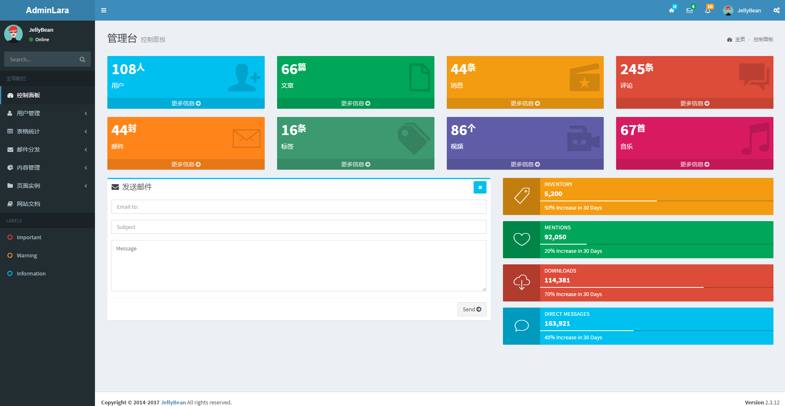
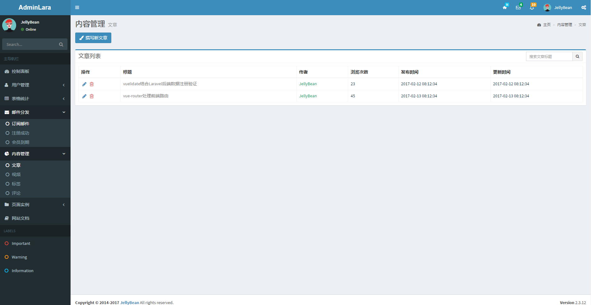
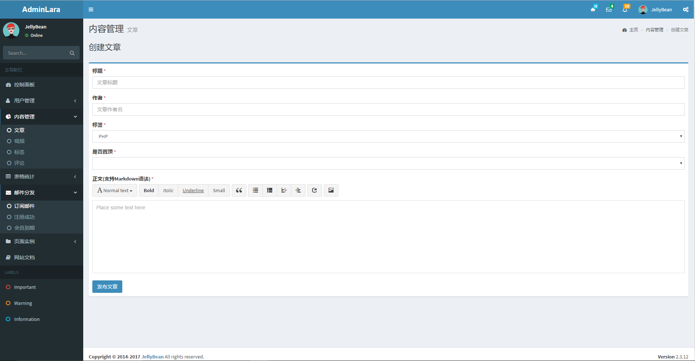

# AdminLTE For Laravel

##  介绍
基于[AdminLTE](https://github.com/almasaeed2010/AdminLTE)的后台模板样式 集成基本的文章 用户模块 其余的功能模板可根据实际项目需求添加


## 效果图
### 后台首页

### 文章列表

### 创建文章


## 安装
### 1.clone到本地
```
git clone https://github.com/GeekGhc/adminLTE-for-laravel.git
```
### 2.根目录下创建.env文件
```
 php artisan key:generate
```

后台开发过程时可借助`MustBeAnAdmin` middleware 完成逻辑判断

在管理用户权限的`Packages`
- [Laravel Permission](https://github.com/spatie/laravel-permission) 目前我的项目就是用的这个`Package`
- [Laravel Roles](https://github.com/romanbican/roles)
- [ultraware/roles](https://github.com/ultraware/roles)
